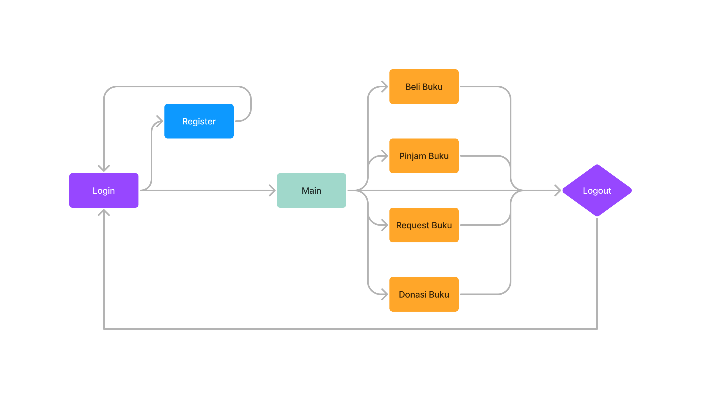

# Proyek Tengah Semester 
## Membuat Situs Web menggunakan Framework Django
## Pemrograman Berbasis Platform

## Nama-nama anggota kelompok
- Ricky Setiawan        (2206083161) 
- Caesar Justitio       (2206082373)
- Devin Faiz Faturahman (2206830593)
- Bimantoro Widyadana   (2206824306)
- Thirza Ahmad Tsaqif   (2206082556)

## Cerita aplikasi yang diajukan serta manfaatnya
Dalam era digital saat ini, tantangan literasi bukan hanya sebatas aksesibilitas buku, tetapi juga bagaimana memotivasi masyarakat untuk terlibat aktif dalam budaya membaca. Sebagai respons terhadap kondisi sosial yang menunjukkan adanya penurunan minat baca, diperkenalkan sebuah inovasi digital bernama `Flex-lib`. Kita memutuskan untuk menggunakan nama `Flex-lib` karena kita membuat sebuah aplikasi literasi yang dapat diakses darimana saja dan kapan saja sehingga sangat fleksibel. Aplikasi web ini merupakan simbol harapan baru bagi pecinta buku dan mereka yang ingin mendalami dunia literasi. `Flex-lib` menawarkan fitur Katalog Buku yang memudahkan pengguna untuk menelusuri koleksi buku berdasarkan berbagai kategori dan preferensi. Bagi mereka yang ingin menambah koleksi pribadi, fitur Beli Buku siap menyajikan pilihan buku baru maupun bekas dengan harga terjangkau. Namun, jika pengguna hanya ingin menikmati buku dalam jangka waktu tertentu, fitur Pinjam Buku memungkinkan mereka untuk meminjam buku tanpa harus mengeluarkan biaya besar. Menyadari betapa berharganya setiap buku dan pentingnya mendistribusikan ilmu kepada yang membutuhkan, `Flex-lib` memfasilitasi fitur Donasi Buku, di mana masyarakat dapat berdonasi atau menerima buku dari donatur lainnya. Selain itu, fitur Request Buku memungkinkan pengguna untuk meminta buku tertentu yang belum ada dalam katalog, menggambarkan bagaimana aplikasi ini berupaya memenuhi kebutuhan literasi setiap individu. Dengan `Flex-lib`, kita bukan hanya menghadirkan buku ke hadapan masyarakat, tetapi juga mengajak masyarakat datang kepada buku, merangkul mereka dalam budaya literasi, dan membangun jembatan pengetahuan yang lebih inklusif dan kolaboratif.

- #### Design Figma UI/UX
  [Desain](https://www.figma.com/file/03JiZU83IzHyWpFgpcsoTf/Untitled?type=design&node-id=0%3A1&mode=design&t=BLakLmqRScbhAlMs-1)
- #### Alur dari aplikasi
  

## Daftar modul yang akan diimplementasikan  
| Modul          | Deskripsi                                                                                                                                                                      |
|----------------|--------------------------------------------------------------------------------------------------------------------------------------------------------------------------------|
| **Katalog Buku:** |                                                                                                                                                                                |
| **GET:**        | Melihat daftar buku                                                                                                                                                                                                                          |
|                | - Pencarian buku berdasarkan judul, penulis, ISBN, atau kata kunci                                                                                                             |
|                | - Detail buku yang mencakup sinopsis, informasi penulis, tanggal terbit, dan ulasan pengguna                                                                                  |
| **POST:**       | Menambahkan buku baru ke dalam katalog                                                                                                                                         |
|                | - Formulir untuk memasukkan data buku baru, termasuk judul, penulis, ISBN, sinopsis, kategori, dan lain-lain                                                                                                                                                                                                                                                                                                                     |
| **Beli Buku:**    |                                                                                                                                                                                |
| **GET:**        | Melihat list buku yang tersedia untuk dibeli                                                                                                                                   |
|                | - Daftar buku dengan harga dan informasi lainnya                                                                                                                                                                                             |
| **POST:**       | Proses pembelian buku                                                                                                                                                         |
|                | - Formulir pembelian yang mencakup data pembeli, alamat pengiriman, metode pembayaran, dan lain-lain                                                                                                                                                                   |
| **Pinjam Buku:**  |                                                                                                                                                                                |
| **GET:**        | Melihat list buku yang tersedia untuk dipinjam                                                                                                                                |
|                | - Daftar buku dengan informasi status ketersediaan untuk peminjaman                                                                                                            |
| **POST:**       | Proses peminjaman buku                                                                                                                                                       |
|                | - Formulir peminjaman yang mencakup data peminjam, tanggal pengembalian, dan lain-lain                                                                                                                                                                                                       |
|                | - Proses pengembalian buku dan mengupdate status ketersediaan buku                                                                                                             |
| **Request Buku:** |                                                                                                                                                                                |
| **GET:**        | Melihat daftar buku yang telah diminta oleh pengguna lain                                                                                                                     |
|                | - Daftar permintaan buku beserta statusnya (mis. pending, diterima, ditolak)                                            
|
|                | - Pencarian Buku yang direquest oleh user                                                                                              |
| **POST:**       | Membuat permintaan buku baru                                                                                                                                                  |
|                | - Formulir untuk memasukkan data buku yang diinginkan                                                                                                                          |
| **DELETE:**     | Membatalkan permintaan buku                                                                                                                                                                                                                                            |
| **Donasi Buku:** |                                                                                                                                                                                |
| **GET:**        | Melihat daftar buku yang didonasikan oleh pengguna lain                                                                                                                       |
|                | - Daftar buku yang tersedia untuk didonasikan beserta kondisi dan detailnya                                                                                                    |
| **POST:**       | Menambahkan buku untuk didonasikan                                                                                                                                           |
|                | - Formulir untuk memasukkan data buku yang ingin didonasikan, termasuk kondisi buku dan lain-lain                                                                            |
| **DELETE:**     | Menghapus buku dari daftar donasi                                                                                                                                              |
|                | - Menghapus entri buku yang didonasikan berdasarkan ID buku atau judul buku                                                                                                     |

## Sumber dataset katalog buku
    |- https://www.kaggle.com/datasets/arashnic/book-recommendation-dataset 
      |- Books.csv
Kita memilih dataset ini dikarenakan kita memerlukan gambar untuk aplikasi kami. Saat kami mencari-cari dataset, dataset inilah yang paling cocok untuk aplikasi kami.
## Role atau peran pengguna beserta deskripsinya (karena bisa saja lebih dari satu jenis pengguna yang mengakses aplikasi)
- Pengguna Non-Login:
Pengguna non-login adalah mereka yang mengunjungi aplikasi perpustakaan tanpa masuk atau membuat akun. Mereka memiliki akses terbatas hanya untuk melihat katalog buku yang tersedia dalam perpustakaan. Mereka tidak dapat menggunakan fitur-fitur lainnya.

- Pengguna Login:
Pengguna login adalah individu yang telah membuat akun dan masuk ke dalam aplikasi perpustakaan. Mereka memiliki akses penuh ke seluruh fitur-fitur aplikasi, termasuk:
  * Melihat Katalog Buku
  * Membeli Buku
  * Meminjam Buku
  * Merequest Buku
  * Mendonasikan Buku.
  
- Pustakawan:
Pustakawan adalah petugas perpustakaan yang memiliki hak akses penuh ke dalam aplikasi "Flex-lib". Mereka memiliki akses penuh ke seluruh fitur-fitur aplikasi serta memiliki tanggung jawab tambahan, untuk menambahkan buku baru.